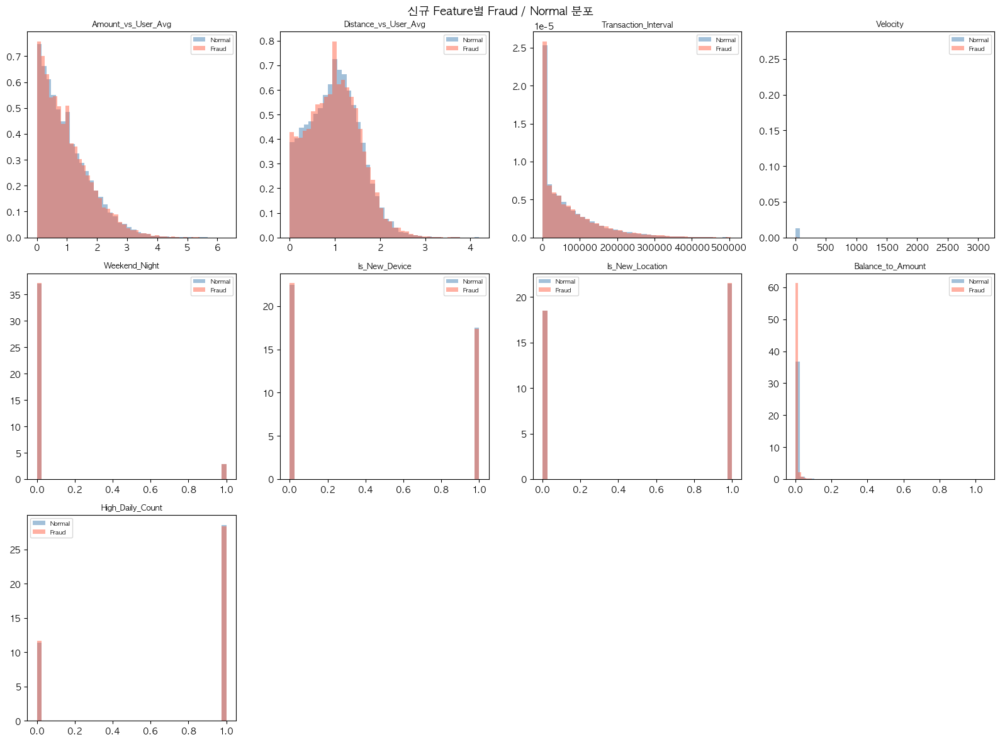
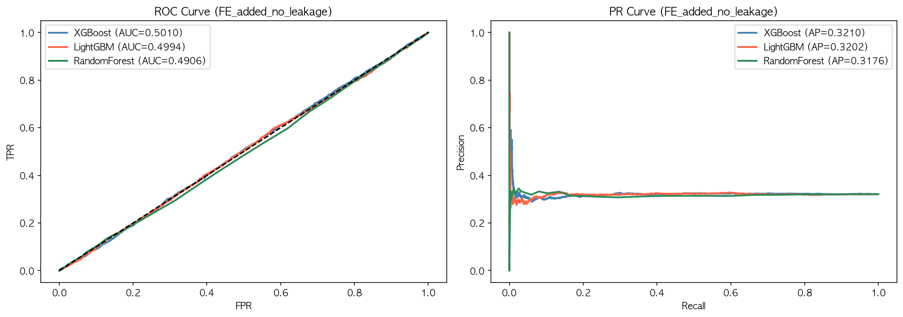
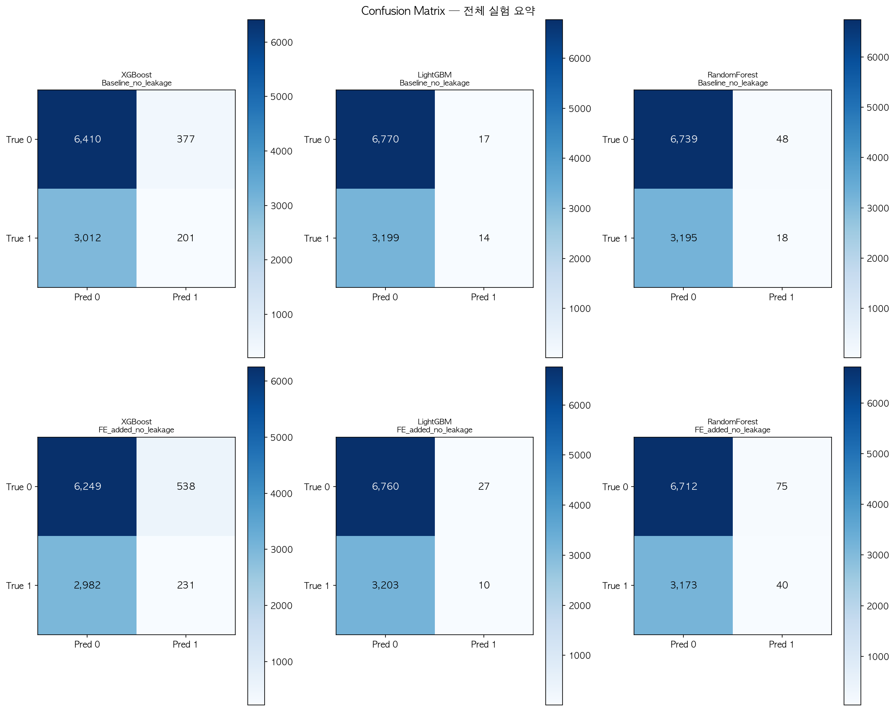
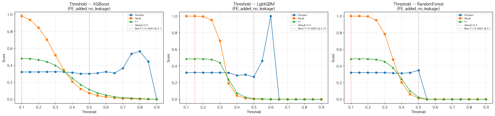
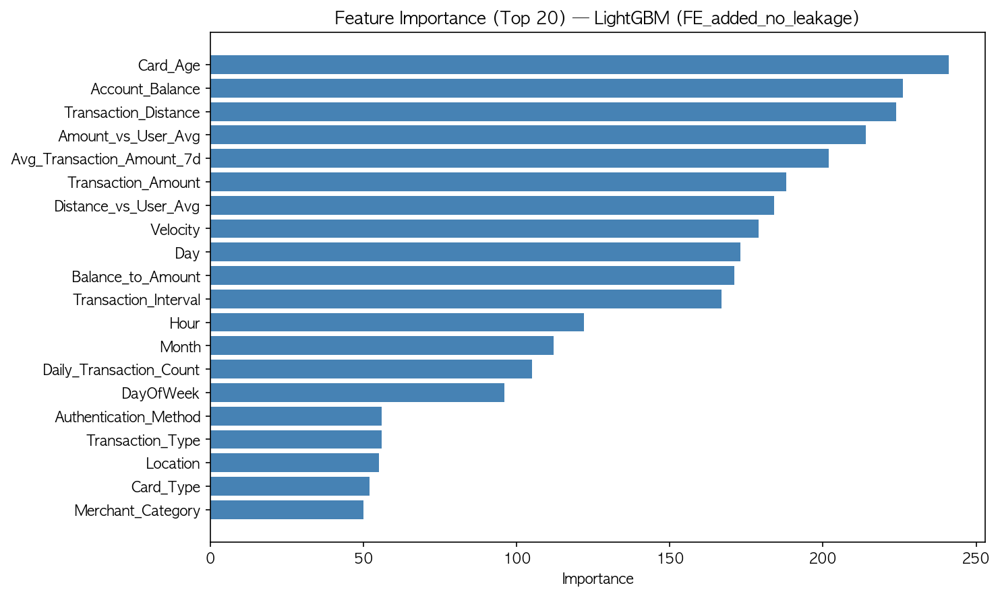
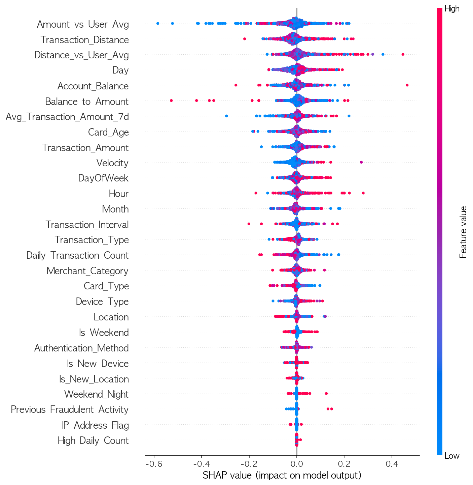

# Financial Fraud Detection System (Leakage-Free FDS)

금융 거래 데이터 기반 이상거래 탐지(Fraud Detection System, FDS) 캡스톤 디자인 프로젝트입니다.  
본 프로젝트는 단순히 높은 성능을 만드는 것보다, **데이터 누수(Data Leakage)를 제거한 신뢰 가능한 조건에서 실제 거래 feature만으로 사기 거래를 탐지할 수 있는지 검증**하는 것을 목표로 했습니다.

---

## Project Summary

### 1. 프로젝트 목표

온라인 결제, 모바일 뱅킹, 카드 결제 등 금융 거래가 디지털화되면서 이상거래 탐지의 중요성이 커지고 있습니다. 본 프로젝트에서는 금융 거래 데이터의 거래 금액, 거래 시간, 기기, 위치, 가맹점, 계좌 잔액, 거래 거리 등의 feature를 활용하여 정상 거래와 사기 거래를 분류하는 모델을 구축하고자 했습니다.

초기 실험에서는 AUC가 0.99 수준으로 매우 높게 나타났지만, Feature Importance 분석 결과 모델이 `Risk_Score`와 같은 누수 의심 변수에 과도하게 의존한다는 점을 확인했습니다. 따라서 기존 성능을 그대로 받아들이지 않고, `Risk_Score`를 제거한 **leakage-free 환경**에서 다시 실험을 설계했습니다.

### 2. 데이터셋 선정 배경

실제 신용카드 및 금융 거래 데이터는 개인정보와 보안 이슈가 포함되어 있어 공개 데이터 확보가 매우 제한적입니다. 따라서 본 프로젝트에서는 Kaggle 공개 금융 거래 데이터셋을 활용했습니다. 다만 공개 데이터셋은 label 생성 방식이나 feature 생성 과정이 명확하지 않을 수 있으므로, 데이터셋 구조와 leakage 가능성을 함께 검토했습니다.

### 3. 핵심 실험 흐름

```text
Leakage 제거
→ Baseline 모델 학습
→ 행동 기반 Feature Engineering
→ XGBoost / LightGBM / RandomForest 비교
→ Threshold Tuning
→ Feature Importance / SHAP 분석
→ Autoencoder / Stacking 실험
→ 최종 원인 분석
```

### 4. 신규 Feature Engineering

기존 거래 feature만으로는 사용자 맥락을 반영하기 어렵다고 판단하여, “그 사람답지 않은 거래”를 포착하기 위한 행동 기반 feature 9개를 추가했습니다.

| Feature | 의미 | 목적 | 실험상 관찰 |
|---|---|---|---|
| `Amount_vs_User_Avg` | 현재 거래금액 / 사용자 평균 거래금액 | 평소보다 큰 거래 탐지 | Fraud/Normal 분포 겹침 |
| `Distance_vs_User_Avg` | 현재 거래거리 / 사용자 평균 거래거리 | 평소보다 먼 위치 거래 탐지 | Fraud/Normal 분포 겹침 |
| `Transaction_Interval` | 이전 거래와의 시간 간격 | 짧은 간격 연속 거래 탐지 | 단독 구분력 약함 |
| `Velocity` | 거래 거리 / 시간 간격 | 물리적으로 어려운 이동 패턴 탐지 | 일부 outlier 중심 |
| `Weekend_Night` | 주말 새벽 거래 여부 | 시간 맥락 기반 이상 탐지 | 영향 제한적 |
| `Is_New_Device` | 평소와 다른 기기 여부 | 계정 탈취 가능성 탐지 | 단독 구분 어려움 |
| `Is_New_Location` | 평소와 다른 지역 여부 | 위치 이상 탐지 | 단독 구분 어려움 |
| `Balance_to_Amount` | 거래금액 / 계좌잔액 | 잔액 대비 큰 거래 탐지 | 분포 겹침 |
| `High_Daily_Count` | 하루 거래 횟수 과다 여부 | 반복 거래 탐지 | 영향 제한적 |

### 5. 주요 실험 결과

| Dataset | Model | ROC-AUC | PR-AUC | Precision | Recall | F1 |
|---|---|---:|---:|---:|---:|---:|
| Baseline_no_leakage | XGBoost | 0.5068 | 0.3290 | 0.3478 | 0.0626 | 0.1060 |
| Baseline_no_leakage | LightGBM | 0.5037 | 0.3279 | 0.4516 | 0.0044 | 0.0086 |
| Baseline_no_leakage | RandomForest | 0.4983 | 0.3203 | 0.2727 | 0.0056 | 0.0110 |
| FE_added_no_leakage | XGBoost | 0.5010 | 0.3210 | 0.3004 | 0.0719 | 0.1160 |
| FE_added_no_leakage | LightGBM | 0.4994 | 0.3202 | 0.2703 | 0.0031 | 0.0062 |
| FE_added_no_leakage | RandomForest | 0.4906 | 0.3176 | 0.3478 | 0.0124 | 0.0240 |

Feature Engineering 이후에도 ROC-AUC는 0.5 수준에 머물렀습니다. Threshold를 낮추면 Recall은 높아졌지만 Precision이 약 0.32 수준에 머물러 정상 거래 오탐이 과도하게 발생했습니다.

Hybrid 실험 결과도 유사했습니다.

| Model | Method | ROC-AUC | PR-AUC | Interpretation |
|---|---|---:|---:|---|
| Autoencoder | 정상 거래 재구성 오차 기반 이상탐지 | 0.5066 | 0.3242 | 비지도 anomaly score도 label 분리에 실패 |
| Stacking | XGB + LGBM + RF 결합 | 0.4986 | 0.3191 | 모델 복잡도 증가로 해결되지 않음 |

---

## Code Instruction

### 1. Repository Structure

```text
Capstone-DS-Final-Consistent/
├── README.md
├── requirements.txt
├── .gitignore
├── data/
│   ├── raw/
│   │   └── .gitkeep
│   └── processed/
│       └── .gitkeep
├── notebooks/
│   └── new_syja_528.ipynb
├── src/
│   ├── __init__.py
│   └── run_experiments.py
├── results/
│   ├── metrics/
│   │   ├── model_comparison.csv
│   │   ├── threshold_best_summary.csv
│   │   └── hybrid_results.csv
│   └── figures/
│       ├── confusion_matrix/
│       ├── roc_pr/
│       ├── threshold_tuning/
│       ├── feature_importance/
│       ├── shap_summary_plot/
│       └── feature_distribution/
├── docs/
│   ├── experiment_log.csv
│   ├── feature_dictionary.csv
│   └── file_manifest.csv


```

> 원본 데이터 CSV는 개인정보 및 공개 범위 이슈를 고려하여 저장소에 포함하지 않았습니다. `data/raw/` 폴더에 데이터를 직접 배치하면 코드를 실행할 수 있습니다.

### 2. Installation

```bash
# 1. 저장소 클론 또는 ZIP 압축 해제
cd Capstone-DS-Final-Consistent

# 2. 가상환경 생성
python -m venv .venv

# Windows
.venv\Scripts\activate

# macOS / Linux
source .venv/bin/activate

# 3. 패키지 설치
pip install -r requirements.txt
```

### 3. Dataset Preparation

실험 재현을 위해 아래 두 파일을 `data/raw/` 폴더에 넣어주세요.

```text
data/raw/train_dataset.csv
data/raw/test_dataset.csv
```

필수 컬럼 예시는 다음과 같습니다.

```text
Transaction_ID, User_ID, Transaction_Amount, Transaction_Type, Timestamp,
Account_Balance, Device_Type, Location, Merchant_Category, IP_Address_Flag,
Previous_Fraudulent_Activity, Daily_Transaction_Count, Avg_Transaction_Amount_7d,
Failed_Transaction_Count_7d, Card_Type, Card_Age, Transaction_Distance,
Authentication_Method, Risk_Score, Is_Weekend, Fraud_Label
```

본 프로젝트의 leakage-free 실험에서는 `Risk_Score`와 `Failed_Transaction_Count_7d`를 제거한 뒤 모델링을 수행했습니다.

### 4. Run Experiments

전체 실험 실행:

```bash
python src/run_experiments.py \
  --train data/raw/train_dataset.csv \
  --test data/raw/test_dataset.csv
```

SHAP 계산은 시간이 오래 걸릴 수 있으므로 생략할 수 있습니다.

```bash
python src/run_experiments.py --skip-shap
```

Autoencoder 또는 Stacking 실험을 생략하려면 다음 옵션을 사용할 수 있습니다.

```bash
python src/run_experiments.py --skip-autoencoder --skip-stacking
```

실행 결과는 아래 경로에 저장됩니다.

```text
results/metrics/
results/figures/confusion_matrix/
results/figures/roc_pr/
results/figures/threshold_tuning/
results/figures/feature_importance/
results/figures/shap_summary_plot/
results/figures/feature_distribution/
```

---

## Demo

아래는 본 프로젝트에서 생성한 주요 시각화 결과입니다.

### 1. Feature Distribution

신규 feature의 Fraud / Normal 분포를 비교했습니다. 대부분의 feature에서 두 클래스 분포가 크게 겹쳤고, 이는 성능 개선이 제한적이었던 주요 원인으로 해석됩니다.



### 2. ROC / PR Curve

Feature Engineering을 적용한 뒤에도 XGBoost, LightGBM, RandomForest의 ROC-AUC는 0.5 수준에 머물렀습니다.



### 3. Confusion Matrix

기본 threshold 0.5에서는 사기 거래를 대부분 정상으로 예측하는 경향이 나타났습니다.



### 4. Threshold Tuning

threshold를 낮추면 Recall은 상승하지만, Precision이 사기 비율 수준에 머물러 정상 거래 오탐이 과도하게 발생했습니다.



### 5. Feature Importance / SHAP

Feature Importance에서는 일부 신규 feature가 상위에 등장했지만, SHAP 값은 0 주변에 집중되어 예측 방향성이 강하지 않았습니다.





---

## Conclusion and Future Work

### 1. Conclusion

본 프로젝트의 핵심 결론은 다음과 같습니다.

1. 초기 AUC 0.99 수준의 성능은 `Risk_Score`에 의존한 가짜 성능으로 판단했습니다.
2. `Risk_Score` 등 누수 의심 변수를 제거한 뒤 모델 성능은 AUC 0.5 수준으로 하락했습니다.
3. 행동 기반 신규 feature 9개를 추가했지만 성능 개선은 제한적이었습니다.
4. XGBoost, LightGBM, RandomForest뿐 아니라 Autoencoder와 Stacking까지 적용해도 유의미한 개선이 없었습니다.
5. 따라서 현재 병목은 모델 복잡도가 아니라, leakage-free feature set의 label separation 부족으로 판단했습니다.

### 2. 데이터셋 선정에서 얻은 교훈

실제 신용카드 거래 데이터는 개인정보와 보안 이슈로 공개 데이터 확보가 제한적이기 때문에 Kaggle 공개 데이터셋을 활용할 수밖에 없었습니다. 이번 프로젝트를 통해, 모델링 이전에 다음 항목을 먼저 검증하는 것이 중요하다는 점을 확인했습니다.

- 데이터셋의 label 생성 방식
- feature가 실제 예측 시점에서 사용 가능한 정보인지 여부
- train/test 분리 방식과 시계열 무결성
- leakage 가능성이 높은 변수 존재 여부
- 공개 데이터셋의 구조적 한계

### 3. Future Work

본 프로젝트는 남은 기간 내 추가 성능 개선보다, leakage-free 환경에서 현재 데이터셋과 feature set의 한계를 검증하는 데 초점을 맞추었습니다. 후속 연구에서는 더 긴 사용자 이력 데이터와 시간 순서가 보장된 rolling window feature를 확보한 뒤 모델링을 진행할 필요가 있습니다.

---

## Team

- 오은서
- 강지원
- 최소현

Kyung Hee University  
Data Science Track Capstone Design
